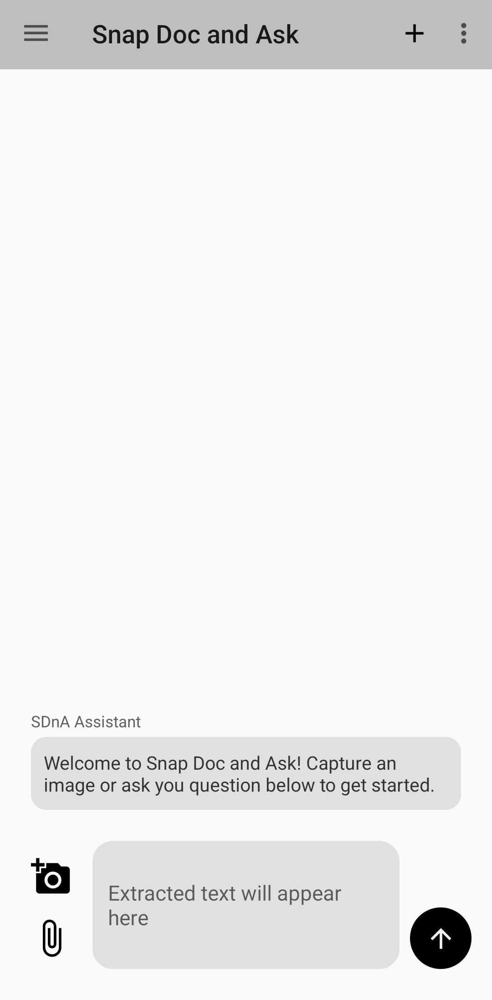
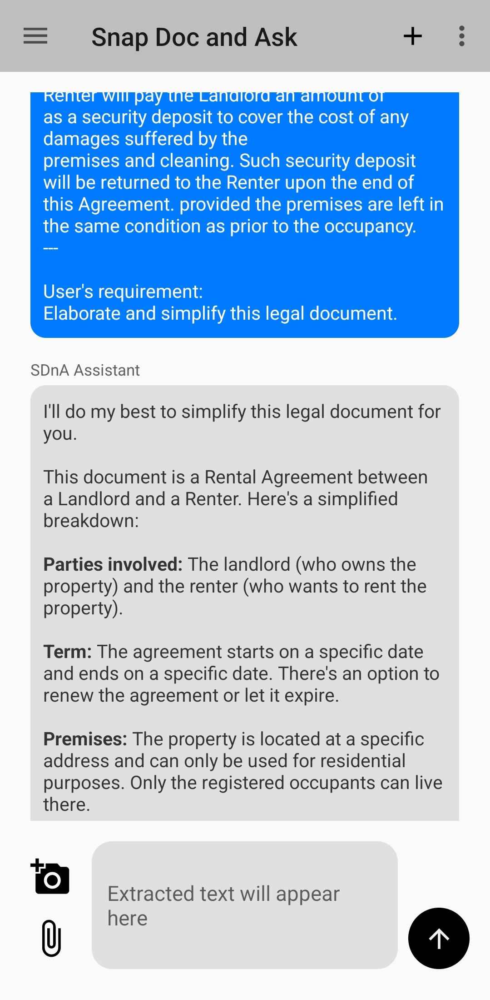
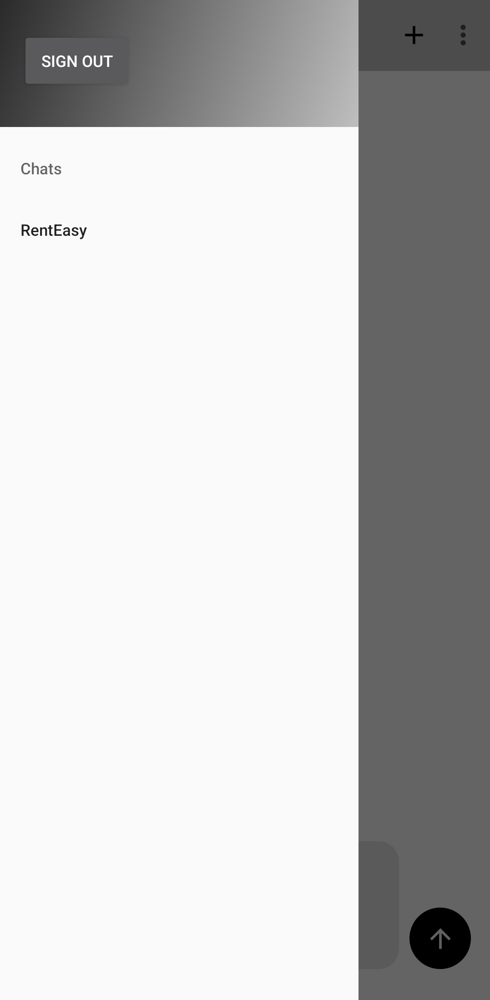

# Snap Doc & Ask: A Mobile App Streamlining Document Interactions

## Introduction

In today's fast-paced digital world, efficiency is key, particularly when dealing with vast amounts of text. "Snap Doc & Ask" offers a cutting-edge solution by combining the capabilities of OCR (Optical Character Recognition) and AI-powered conversational interfaces to streamline the processing and interaction with document texts. This mobile application allows users to capture document images or select them from a gallery, extract text via OCR, and interact with this text through a state-of-the-art language model.

## How It Works

The core functionality of "Snap Doc & Ask" revolves around its user-friendly chat-like interface. Users can either capture a document directly through the camera or upload up to five images from their gallery. Google ML Kit is employed to perform OCR on these images, converting visual data into editable and queryable text.

Once the text is captured, users can pose questions directly related to the OCR-generated text. These inquiries are then processed by a powerful Large Language Model (LLM), which offers detailed responses. The interaction doesn't just stop at a single exchange; users can continue the conversation, asking follow-up questions. Each query and its corresponding responses are passed to the LLM via a robust API, ensuring that even follow-up questions consider the context of the entire conversation history.

---

## Unique Features

- **Efficient Text Handling:** Streamline the interaction with documents by allowing text extraction and direct queries on the extracted text.
- **Seamless User Experience:** Operates like a chat application, making it intuitive and easy to use.
- **Smart Interaction:** Leveraging a state-of-the-art LLM to answer queries based on the document's text.
- **Secure and Private:** User authentication via Firebase ensures that chats are private and secure. Additionally, users can delete conversations, which are then permanently removed from the Firebase database.

## Conclusion

"Snap Doc & Ask" is not just an app but a revolutionary tool designed to make document handling as effortless as possible. By integrating advanced OCR with intelligent conversational AI, this app opens new avenues for interacting with textual content, making it an indispensable tool for professionals and students alike.